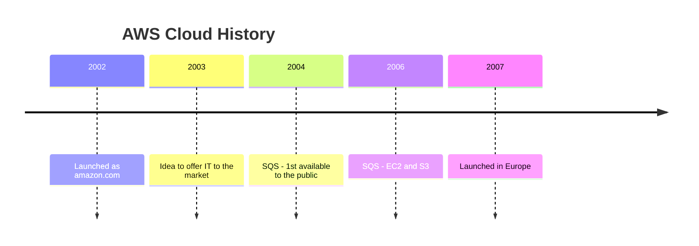

# AWS Cloud Practitioner - CLF-C02 exam

<!-- TOC depthFrom:2 -->
- [Cloud Computing](#cloud-computing)
    * [Deployment Models](#deployment-models)
    * [Characteristics of Cloud Computing](#characteristics-of-cloud-computing)
    * [Advantages of Cloud Computing](#advantages-of-cloud-computing)
    * [Problems solved by the Cloud](#advantages-of-cloud-computing)
    * [Different Types of Cloud Computing](#different-types-of-cloud-computing)
<!-- /TOC -->

## Cloud Computing

Cloud computing is the `on-demand delivery` of compute power, database storage, applications, and other IT resources.
Resources can be provisioned in the exact type and size of computing needed, and you pay as it go, only for what you use.

AWS (Amazon Web Services) owns and maintains the network-connected hardware required for these application services, while you provision and use what you need via a web 
application.   

### Deployment Models
#### Private Cloud
* Cloud services used by a single organization, not exposed to the public.
* Complete control
* Security for sensitive applications
* Meet specific business needs

#### Public Cloud
* Cloud resources owned and operated by a third-party cloud service provider delivered over the Internet.

#### Hybrid Cloud
* Keep some servers on premises and extend some capabilities to the Cloud
* Control over sensitive assets in your private infrastructure
* Flexibility and cost-effectiveness of the public cloud

### Characteristics of Cloud Computing
#### On-demand self-service
* Users can provision resources and use them without human interaction from the service provider

#### Broad network access
* Resources available over the network, and can be accessed by diverse client platforms

#### Multi-tenancy and resource pooling
* Multiple customers can share the same infrastructure and applications with security and privacy
* Multiple customers are serviced from the same physical resources

#### Rapid elasticity and scalability
* Automatically and quickly acquire and dispose resources when needed
* Quick and easily scale based on demand

#### Measured service
* Usage is measured, users pay correctly for what they have used

### Advantages of Cloud Computing
#### Trade capital expense (CAPEX) for operational expense (OPEX)
* Pay on-demand, don't own hardware
* Reduced Total Cost of Ownership (TCO) and Operational Expense (OPEX)

#### Benefit from massive economies of scale
* Prices are reduced as AWS is more efficient due to large scale

#### Stop guessing capacity
* Scale based on actual measured usage

#### Increase speed and agility

#### Stop spending money running and maintaining data centers

#### Go global in minutes: leverage the AWS global infrastructure

### Problems solved by the Cloud
* `Flexibility`: change resource types when needed
* `Cost-Effectiveness`: pay as you go, for what ou use
* `Scalability`: accommodate larger loads by making hardware stronger or adding additional nodes
* `Elasticity`: ability to scale-out and scale-in when needed
* `High-availability` and `fault-tolerance`: build across data centers
* `Agility`: rapidly develop, test and launch software applications

### Different Types of Cloud Computing

#### IaaS - Infrastructure as a Service
* Provides networking, computers, data storage space
* Highest level of flexibility
* Easy parallel with traditional on-premises IT

#### PaaS - Platform as a Service
* Removes the need for your organization to manage the underlying infrastructure
* Focus on the deployment and management of your application

#### SaaS - Software as a Service
* Completed product that is run and managed byt the service provider

#### Management on each Cloud Type
* Managed by you

| On-premises    | IaaS - Infrastructure as a Service | PaaS - Platform as a Service | SaaS - Software as a Service |
|----------------|----------------------------------------|----------------------------------|----------------------------------|
| Applications   | Applications                           | Applications                     |                                  |
| Data           | Data                                   | Data                             |                                  |
| Runtime        | Runtime                                |                                  |                                  |
| Middleware     | Middleware                             |                                  |                                  |
| OS             | OS                                     |                                  |                                  |
| Virtualization |                                        |                                  |                                  |
| Servers        |                                        |                                  |                                  |
| Storage        |                                        |                                  |                                  |
| Networking     |                                        |                                  |                                  |

* Managed by others

| On-premises | IaaS - Infrastructure as a Service | PaaS - Platform as a Service | SaaS - Software as a Service |
|-------------|----------------------------------------|----------------------------------|----------------------------------|
|             | Virtualization                         | Runtime                          | Application                      |
|             | Servers                                | Middleware                       | Data                             |
|             | Storage                                | OS                               | Runtime                          |
|             | Networking                             | Virtualization                   | Middleware                       |
|             |                                        | Servers                          | OS                               |
|             |                                        | Storage                          | Virtualization                   |
|             |                                        | Networking                       | Servers                          |
|             |                                        |                                  | Storage                          |
|             |                                        |                                  | Networking                       |

#### Examples of Cloud Computing Types
* IaaS - Infrastructure as a Service
  * Amazon EC2 on AWS
  * GCP, Azure

* PaaS - Platform as a Service
  * Elastic Beanstalk on AWS
  * Heroku, Google App Engine on GCP, Windows Azure on Microsof
* SaaS - Software as a Service
  * AWS Services as Rekognition for Machine Learning
  * Google Apps as Gmail and Photos, Zoom, Dropbox  

#### Pricing
* AWS has 3 pricing fundamentals, following the pay-as-you-go pricing model
  * Compute: Pay for compute time
  * Storage: Pay for data stored in the Cloud
  * Data Transfer OUT of the Cloud: Data transfer IN is free

