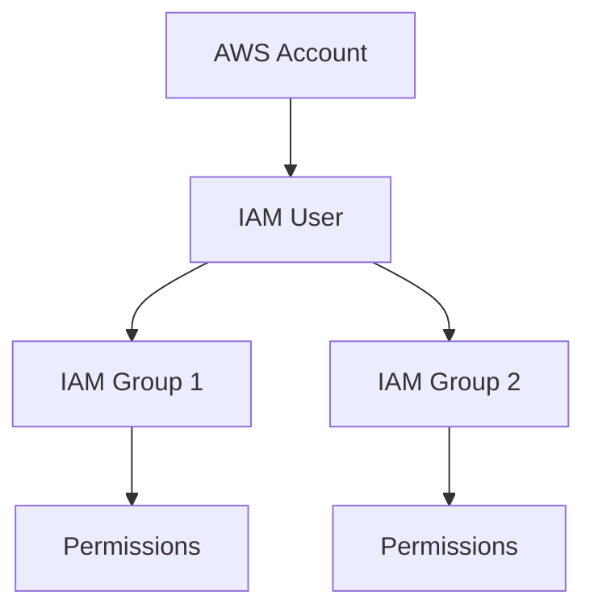

# IAM - Identity and Access Management

`IAM` is a `AWS Global Service` where users, groups, roles and policies are created.

<!-- TOC depthFrom:2 -->
- [Best Practices](#iam-best-practices)
- [AWS IAM Users, Groups and Permissions](#aws-iam-users-groups-and-permissions)
- [Root account](#root-account)
- [Users](#users)
- [Groups](#groups)
- [Permissions](#permissions)
- [Roles for Services](#roles-for-services)
- [Security Tools](#iam-security-tools)
- [Share Responsibility Model for IAM](#share-responsibility-model-for-iam)

<!-- /TOC -->

## IAM Best Practices
* Don't use root account except for AWS account setup.
* One physical user = One AWS user.
* Assign users to groups and assign permissions to groups.
* Create strong password policy.
* Always enable MFA for your root account and IAM users.
* Prefer using IAM roles over IAM users for applications and services.
* Follow the Least Privilege Principle, grant the minimum necessary permissions using IAM policies.
* Use Access Keys for programmatic access like: CLI/SDK.
* Regular Audits: Regularly review IAM policies, roles, and user permissions using IAM Access Advisor and Credential Reports.
* Never share IAM users and access keys.

## AWS IAM Users, Groups and Permissions

- **AWS Account**: Represents the overall AWS account.
- **IAM User**: An individual IAM user with unique credentials.
- **IAM Groups**: Containers that organize IAM users based on common roles or permissions.
    - **IAM Group 1**: Contains specific users and associated permissions.
        - **Permissions**: Permissions assigned to users in IAM Group 1.
    - **IAM Group 2**: Another group with its own set of users and permissions.
        - **Permissions**: Permissions assigned to users in IAM Group 2.

## Root account
The Root account is automatically created as the initial AWS account when you sign up for AWS services. It has full access and control over all resources and services within the AWS account, including billing information and the ability to manage IAM users, groups, roles, and policies.

AWS best practices strongly advise against using or sharing the Root account. Instead, it is recommended to create IAM users with the minimum necessary permissions, following the principle of least privilege.

## Users
IAM users are commonly used to represent individuals or entities (like applications or services) that interact with AWS services. By creating and managing IAM users, AWS account owners can enforce security best practices, audit access logs, and maintain control over resource usage within their AWS environment.

### Key characteristics of IAM Users:

#### Identity
Each IAM user has a unique identity within an AWS account. They are used to authenticate and authorize access to AWS resources.

#### Access Permissions
IAM users have specific access permissions granted to them through IAM policies. These policies define what actions the IAM user can perform on which AWS resources.

#### Separation of Privileges
IAM users allow for the `principle of least privilege by granting only the necessary permissions required` for their tasks. This helps in maintaining security and minimizing risks associated with excessive permissions.

#### Credentials
IAM users have their own credentials (such as access keys, secret access keys, and passwords) used for programmatic or console-based access to AWS services.

#### Manages and Secured
IAM users can be managed centrally, and their access and permissions can be modified or revoked as needed. Additionally, IAM supports Multi-Factor Authentication (MFA) for added security.

## Groups
Groups are containers used to manage collections of IAM users. Groups make it easier to assign permissions to multiple users simultaneously, simplifying the process of managing 
access to AWS resources.  
An IAM user is not required to belong to a group, but they can be added to one or more groups as needed.

### Key characteristics of IAM Groups:

#### Logical Collections
Groups are logical collections of IAM users. They allow you to organize users based on common job functions, projects, or other criteria.

#### Permission Assignment
Permissions are assigned to groups using IAM policies. When a user is added to a group, they inherit the permissions granted to that group.

#### Simplified Management
Instead of assigning permissions to individual users, you can assign permissions to groups. This simplifies permission management and reduces the risk of granting excessive or unnecessary permissions to individual users.

#### Flexibility
Users can belong to multiple groups, allowing for flexible management of permissions based on different roles or responsibilities.

#### Centralized Control
Changes to permissions for a group are applied to all users within that group automatically, providing centralized control over access permissions.

## Permissions
Refer to the authorization rules that determine what actions are allowed or denied on AWS resources for IAM users, groups, roles, and other entities.  
Permissions are defined using IAM policies, which are JSON documents that specify the permissions and associated resources.

### Key characteristics about Permissions in IAM:

#### Actions
Permissions define specific actions that can be performed on AWS resources.  
For example, actions like `s3:GetObject`, `ec2:RunInstances`, or `iam:ListUsers` represent operations that can be executed on `S3` objects, `EC2` instances, or `IAM` users, respectively.

#### Resources
Permissions are applied to specific AWS resources such as `S3` buckets, `EC2` instances, `DynamoDB` tables, `IAM` users, etc.  
The resource is specified using Amazon Resource Names (ARNs) within IAM policies.

#### Effect
IAM policies can explicitly allow `"Effect": "Allow"` or deny `"Effect": "Deny"` actions on resources.  
When multiple policies are attached to an entity, the most restrictive policy (either an explicit deny or a deny not overridden by an allow) takes precedence.

#### Granularity
IAM provides fine-grained control over permissions, allowing you to specify permissions at the level of individual actions and resources.  
This granularity supports the principle of least privilege, where entities are granted only the permissions necessary to perform their intended tasks.

#### Policy Evaluation
Permissions are evaluated based on the combination of policies attached to the IAM entity (user, group, role).  
IAM policies can be managed directly (inline policies) or attached from managed policies (AWS-managed or customer-managed policies).

## Roles for Services
AWS IAM roles for services `enable AWS services to perform actions on your behalf`.  
Instead of embedding credentials directly into the service configurations, you assign roles to services, granting them the necessary permissions to interact with other AWS 
resources securely and efficiently.

#### Common Use Cases for AWS IAM Roles for Services
##### EC2 Instances
Assigning a role to an EC2 instance allows it to interact with other AWS services (e.g., reading from S3, writing logs to CloudWatch) without embedding credentials in the instance.

##### Lambda Functions
Roles can be assigned to AWS Lambda functions to grant them permissions needed to access other AWS resources, such as databases, S3 buckets, or invoking other AWS services.

#### How to Define an IAM Role for a Service
1. Create the Role
2. Attach Policies
3. Assign the Role to a Service

## IAM Security Tools

### IAM Credentials Report - account-level
Reports that provide details about the status of IAM users’ credentials.  
Generate reports to monitor user access keys, passwords, and MFA device status, helping ensure compliance with security policies.

### IAM Access Advisor - user-level
Shows the last access time for services by IAM users and roles, and the last time those services were used. 

## Share Responsibility Model for IAM

### AWS
* Infrastructure (Global Security Network)
* Configuration and Vulnerability Analysis
* Compliance Validation

### You
* Users, Groups, Roles, Policies, Management and Monitoring
* Enable MFA on all accounts
* Rotate all keys often
* Use IAM tools to apply appropriate permissions
* Analyse access patterns and review permissions  
